# 曲线数据集

注：本文设计的波形数据可在 [https://pan.baidu.com/s/1PXyKqeTfemepZ-wD9gDwYQ?pwd=2cda](https://pan.baidu.com/s/1PXyKqeTfemepZ-wD9gDwYQ?pwd=2cda) 下载。

## 数据格式介绍

`TraceDataset`是`CrackNuts`采集的波形数据管理类，他以`zarr`作为默认存储格式，以文件夹形式进行存储。他的结构如下：

- traces:
  - directory.zarr/X/Y/traces
- data:
  - directory.zarr/X/Y/ciphertext
  - directory.zarr/X/Y/plaintext
  - (optional) directory.zarr/X/Y/key
  - (optional) directory.zarr/X/Y/extended

- 曲线和数据信息分别存储在 `/X/Y/traces` 和 `/X/Y/<data>` 路径下。
- 在存储功耗信号时，`/X/Y` `X` 固定为0，`Y` 作为通道标识，例如第一个通道，则路径为 `/0/0/`
- 在存储电磁信号时，`/X/Y` 是电磁侧信道测量的逻辑坐标。
- 其他公共MetaData信息存储在数据根路径的metadata属性中，包含：
  - CrackNuts版本信息
  - 数据创建时间

当使用 `numpy` 作为存储格式时，曲线数据和数据信息分别进行存储在一个名称包含`.npy`后缀的文件夹中。他的目录接口如下：

- traces:
  - directory/trace.npy  
- data:
  - directory/ciphertext.npy
  - directory/plaintext.npy
  - (optional) directory/key.npy
  - (optional) directory/extend.npy

- 曲线存储在根目录下的trace.npy文件下，该文件是numpy格式的保存格式，他是一个三维数组。
- 在存储功耗信号时，第一个维度为默认值0，第二个维度为通道索引，第三维度存储的是曲线数据
- 在存储电磁数据时，第一个和第二个维度分别是电磁的坐标`X Y`坐标信息
- 数据信息则以与曲线同样的格式存储在相对应的`<data>.npy`文件中
- 其他元信息存储在`metadata.json`文件中

## 数据集的基础使用

数据集不需要用户自己创建，采集到的波形数据即为该格式的数据。用户可以通过`TraceDataset.load`方法加载已经采集的波形数据。

### ZarrTraceDataset

默认情况下 `TraceDataset` 使用 `zarr` 作为存储格式，用户可使用 `ZarrTraceDataset` 类加载数据集：

```python
from cracknuts.trace import ZarrTraceDataset

trace_path = r'D:\project\cracknuts\demo\jupyter\dataset\20250521110621(aes).zarr'
zarr_trace = ZarrTraceDataset.load(trace_path)
zarr_trace.info() # 打印数据集的基本信息
```

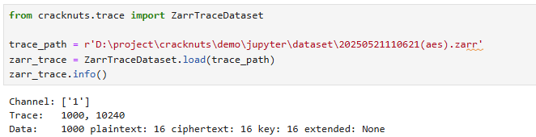

```python
trace = zarr_trace.trace
trace[0, :1] # 获取第一个通道的第一条曲线
```

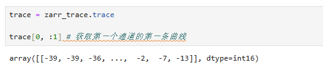

上述代码中，`zarr_trace.trace`： 这里的 `trace` 是一个特殊的属性，他支持两级的切片操作，第一个切片为通道索引、第二个切片为曲线索引。  
他支持类似numpy的高级索引。  

```python
trace, data_array = zarr_trace.trace_data[:2, :2]  # 获取其两通道的前两条曲线
print(trace.shape)
data_array[0][0]  # 第一通道的第一条曲线的数据
```

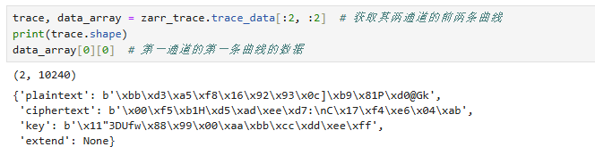

上述代码中，`zarr_trace.trace_data[:2, :2]`：这里的`trace_data`也是类似 `trace` 的支持切片操作的特殊属性，他返回的内容包括数据信息字典的数组，这个数据信息数组是一个二维对象数组，第一个维度是通道索引、第二个维度是曲线索引。

如果你对`zarr`格式较为熟悉，您可以直接过去该数据集对应的 `zarr` 格式数据对象：

```python
origin_zarr = zarr_trace.get_origin_data()

origin_zarr.info
```

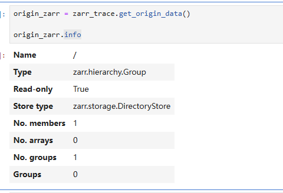

当然，您也可以直接使用`zarr`打开数据文件：

```python
import zarr

trace_path = r'D:\project\cracknuts\demo\jupyter\dataset\20250521110621(aes).zarr'
zarr_trace = zarr.open(trace_path)
zarr_trace.info
```

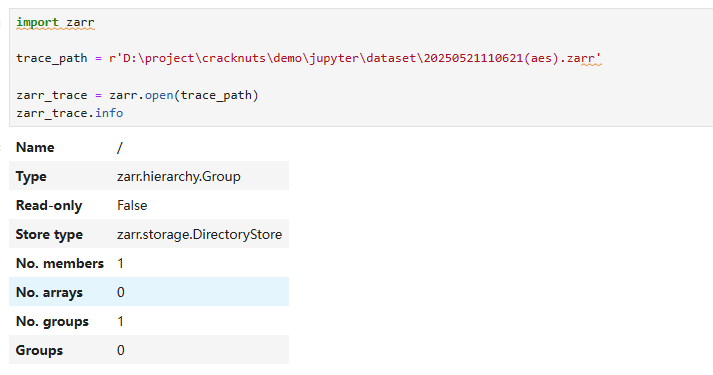

```python
trace = zarr_trace['/0/0/traces']
trace.shape
```

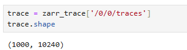

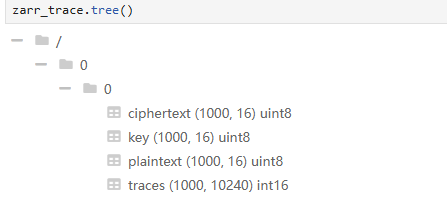


### NumpyTraceDataset

如果您在采集波形数据时，通过界面指定了存储格式，你可以得到以 `numpy` 为存储格式的数据集文件。

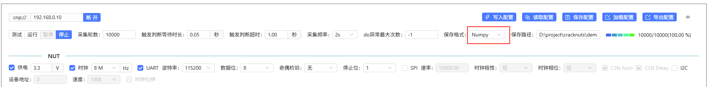

`numpy` 格式的数据集文件可以通过 `NumpyDataset` 类来进行加载：

```python
from cracknuts.trace import NumpyTraceDataset

trace_path = r'D:\project\cracknuts\demo\jupyter\dataset\20250812145028(aes).npy'
trace_numpy = NumpyTraceDataset.load(trace_path)

trace_numpy.info()
```

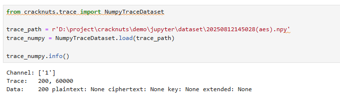

```python
trace = trace_numpy.trace
trace[0, :1] # 获取第一个通道的第一条曲线
```

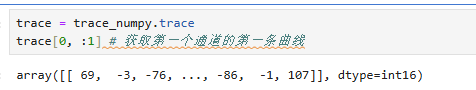

上述代码中，`trace_numpy.trace`： 这里的 `trace` 是一个特殊的属性，他支持两级的切片操作，第一个切片为通道索引、第二个切片为曲线索引。  
他支持类似numpy的高级索引。  

```python
trace, data_array = trace_numpy.trace_data[:2, :2]  # 获取其两通道的前两条曲线
print(trace.shape)
data_array[0][0]  # 第一通道的第一条曲线的数据
```

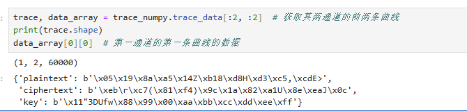

上述代码中，`trace_numpy.trace_data[:2, :2]`：这里的`trace_data`也是类似 `trace` 的支持切片操作的特殊属性，他返回的内容包括数据信息字典的数组，这个数据信息数组是一个二维对象数组，第一个维度是通道索引、第二个维度是曲线索引。

如果你对`numpy`格式较为熟悉，您可以直接过去该数据集对应的 `numpy` 格式数据对象：

```python
import numpy as np

trace_path = r'D:\project\cracknuts\demo\jupyter\dataset\20250812145028(aes).npy\trace.npy' # 这里演示的是曲线数据，同样的也可以加载plaintext.npy 来加载明文数据

trace_numpy = np.load(trace_path)

trace_numpy.shape
```

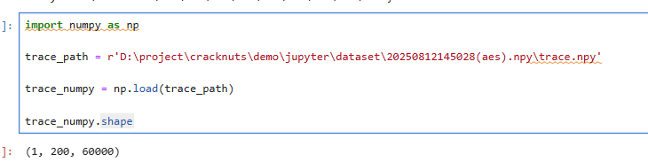

```
origin_trace_numpy, origin_plaintext_numpy, origin_ciphertext_numpy, origin_key_numpy, origin_extend_numpy = trace_numpy.get_origin_data()

print(origin_trace_numpy.shape)
print(origin_plaintext_numpy.shape)
print(origin_ciphertext_numpy.shape)
print(origin_key_numpy.shape if origin_key_numpy is not None else '')
print(origin_extend_numpy.shape if origin_extend_numpy is not None else '')
```

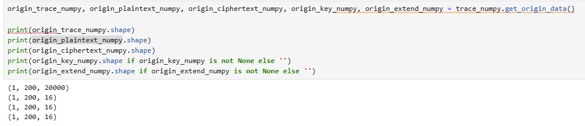

当然，您也可以直接使用`numpy`打开数据文件：

```python
import numpy as np

trace_path = r'D:\project\cracknuts\demo\jupyter\dataset\20250812145028(aes).npy\trace.npy' # 这里演示的是曲线数据，同样的也可以加载plaintext.npy 来加载明文数据

trace_numpy = np.load(trace_path)

trace_numpy.shape
```

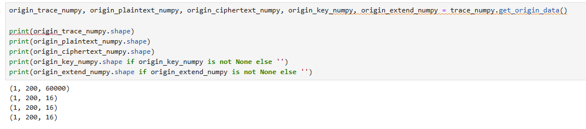


## 相关性数据集（squirrel库分析结果）

如果您使用`cracknuts-squirrel`库进行了相关性、CPA等分析，他可以产生一个最终的相关性矩阵，该数据同样采用`zarr`作为存储格式，其格式如下：

- correlation:
  - directory.zarr/X/Y/correlation

- `/X/Y` 固定为 `/0/0`
- correlation 中存储的是一个 三维数组，
  - 当计算相关性时，第一个维度为 计算相关性的明文或密文的索引，第二个维度为 曲线数据点索引，第三个为 相关性曲线数据
  - 当CPA分析时，第一个维度为猜测密钥的索引，第二个为密钥的比特位索引，第三个为 相关性曲线数据

更多详细内容，请参考 `squirrel` 文档。

## 数据集的展示

`CrackNuts` 提供了一个可在 `jupyter` 环境中展示波形的组件，他可以展示采集到的曲线文件，以及通过`squirrel`分析的分析结果数据。

可参考 上位机-《波形展示》 章节的内容。


