# 波形展示

## 能量轨迹（采集波形数据）

`CrackNuts`上位机提供了用于展示采集到的波形的`jupyter`控件，他可以高效的对波形进行缩放等操作。

如下可以打开一个`CrackNuts`采集到的波形数据集:

```python
import cracknuts as cn
from cracknuts.trace import ZarrTraceDataset

trace_path = r'./dataset/20250519122059.zarr'
# 加载 scarr 格式的数据集
ds = ZarrTraceDataset.load(trace_path)

pt = cn.panel_trace()
pt.set_trace_dataset(ds)
pt
```

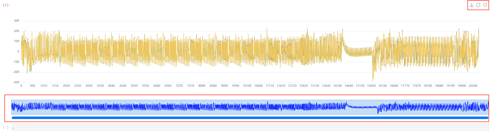

在上图中，有上角的控制区域分别可以下载、重置缩放、开启选择缩放，在下方的缩放指示区域可以显示当前缩放的区间以及进行缩放区间的拖动

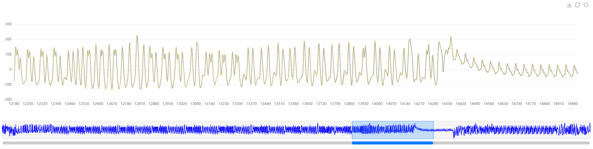

鼠标在波形上点击后可显示当前位置的坐标及数值信息

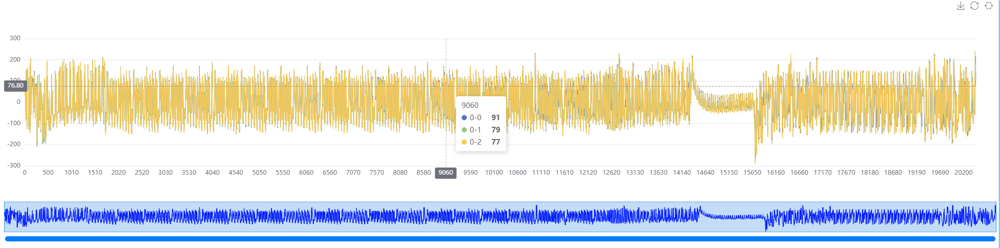

除了在这个`Jupyter`组件中以鼠标进行缩放控制，还可以通过代码进行精确控制

```python
# 通过索引指定缩放的区间
pt.change_range(100, 1000)
```

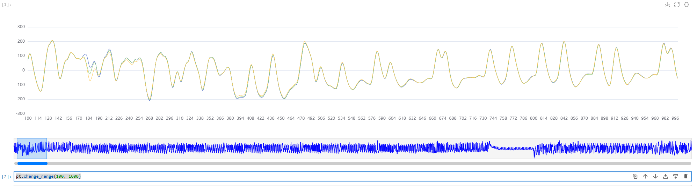

```python
# 通过比例指定缩放的区间
pt.change_percent_range(10, 20)
```

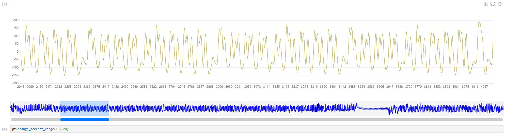

此外由于采集的数据点一般来说会比较大，为了快速展示波形默认展示前三条曲线，当需要切换曲线时，可以通过`show_trace`属性进行控制。
`show_trace`是一个`TracePanelWidget`的属性，他可以进行切片操作，第一个切片是通道索引、第二个是曲线索引。

```python
pt.show_trace[0, :10] # 通道0的前10条
```

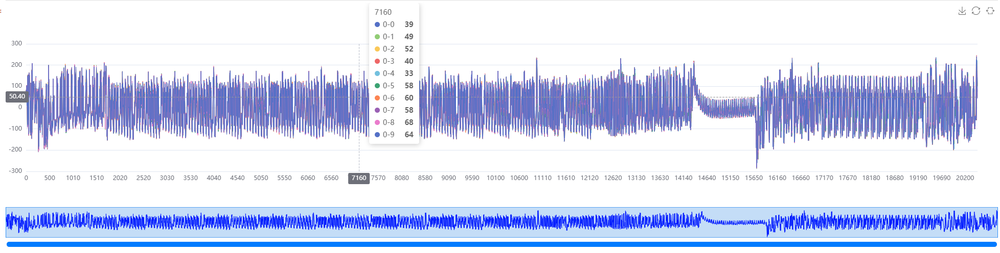

```python
pt.show_trace[0, 1:10:2] # 通道0的1到10，步长为2
```

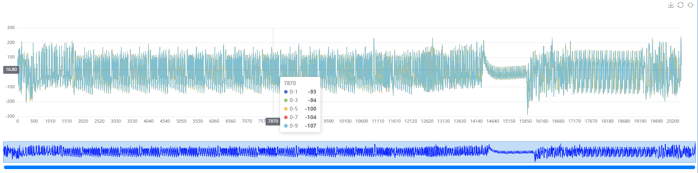


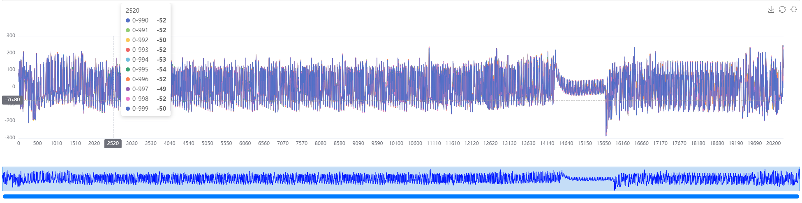

```python
pt.show_trace[0, -10:] # 后10条
```

除了能够打开`CrackNuts`采集的数据集文件外，他还可以直接打开`numpy`数组以方便查看分析中间过程。数组需要是一个一维或二维数组，二维数组时第一个维度为曲线、第二维度为曲线的数据点，如下：

```python
import numpy as np

y = np.random.randint(100, size=(10, 1000)) # 生成一个二维数组

pt.set_numpy_data(y)
```

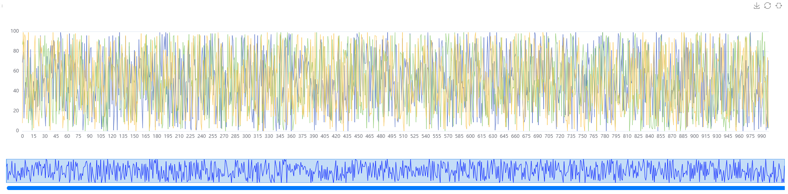

以上是一个随机数的numpy例子，更多的情况是在曲线分析后，可以查看相关性

```python
# 详细曲线分析过程略，参考快速开始章节
from scarr.engines.cpa import CPA as cpa
from scarr.file_handling.trace_handler import TraceHandler as th
from scarr.model_values.sbox_weight import SboxWeight
from scarr.container.container import Container, ContainerOptions
import numpy as np

handler = th(fileName=trace_path) 
model = SboxWeight() 
engine = cpa(model)
container = Container(options=ContainerOptions(engine=engine, handler=handler), model_positions = [x for x in range(16)])
container.run()

result_bytes = np.squeeze(container.engine.get_result())

correlation_best = result_bytes[0, 0x11, :5000] # 第0位的第0x11个猜测密钥的相关型

pt.set_numpy_data(correlation_best)
```

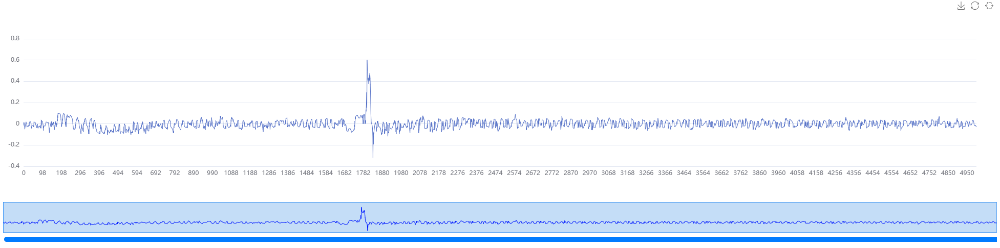

当然也可以查看相关性矩阵的全部数据并高亮猜测出的密钥那条曲线（但不建议这样做，因为我们的组件是具有交互性质的，由于相关性矩阵数据很大会造成页面卡顿，可参考快速开始使用静态展示的方式查看）

```python
correlation = result_bytes[0, :, :5000] # 获取第0位的所有猜测密钥相关性曲线
pt.set_numpy_data(correlation)
pt.show_all_trace() # 展示全部曲线
pt.highlight(0x11) # 高亮
```

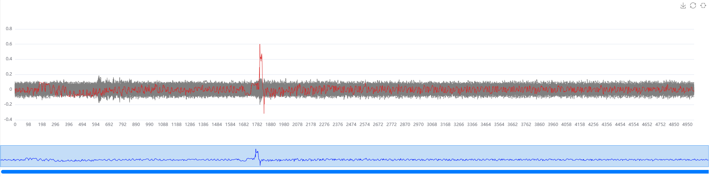

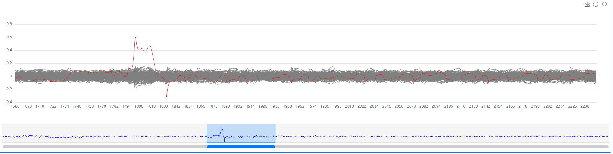


## 相关性（分析结果）

如果您使用`cracknuts-squirrel`库进行了相关性、CPA等分析，他可以产生一个最终的相关性矩阵，该数据同样采用`zarr`作为存储格式，其格式如下：

- correlation:
  - directory.zarr/X/Y/correlation

- `/X/Y` 固定为 `/0/0`
- correlation 中存储的是一个 三维数组，
  - 当计算相关性时，第一个维度为 计算相关性的明文或密文的索引，第二个维度为 曲线数据点索引，第三个为 相关性曲线数据
  - 当CPA分析时，第一个维度为猜测密钥的索引，第二个为密钥的比特位索引，第三个为 相关性曲线数据

其格式与采集数据略有不同，在使用上，将数据的第一个维度代替 能量轨迹 的 通道维度，一次来使用。

更多详细内容，请参考 `squirrel` 文档。

```python
import cracknuts as cn
pt = cn.panel_trace()
pt.set_trace(r'D:\project\cracknuts\demo\jupyter\dataset\20250521110621(aes)_CPAAnalysis.zarr')
pt
```

如上代码就打开一个`squirrel`分析结果，该结果是一个CPA分析结果。

如下面，可以指定查看曲线：

```python
pt.show_trace[0x22, 1] # 显示一条曲线，第 0x22 这个猜测密钥的 第 1 个字节的相关性曲线(该曲线包含相关性的峰值部分)
```

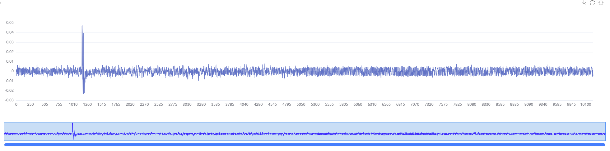

高亮一条曲线：

```python
pt.show_trace[:,0] # 显示第0个字节，所有的猜测密钥相关性
pt.highlight({0x11: 0}) # 高亮 0x11 这个猜测密钥的曲线
```

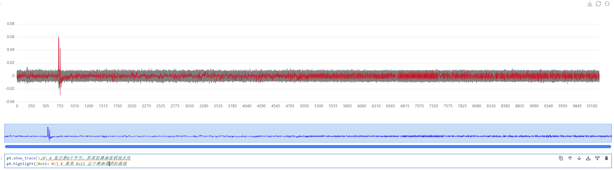

```python
pt.show_trace[[0x11, 0x22, 0x33], [0,1,2]] # 展示多个相关性波峰
pt.highlight({0x22: 1}) # 高亮 0x22 这个猜测密钥的曲线
```

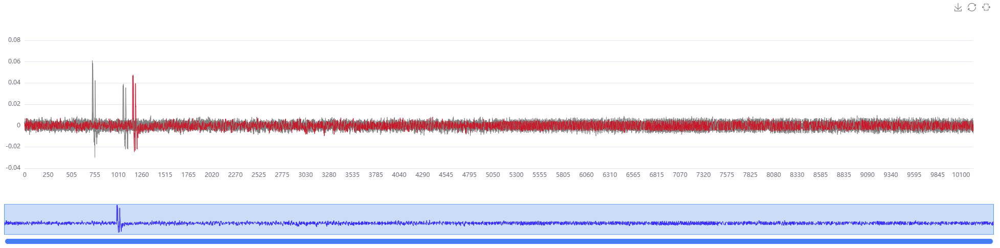