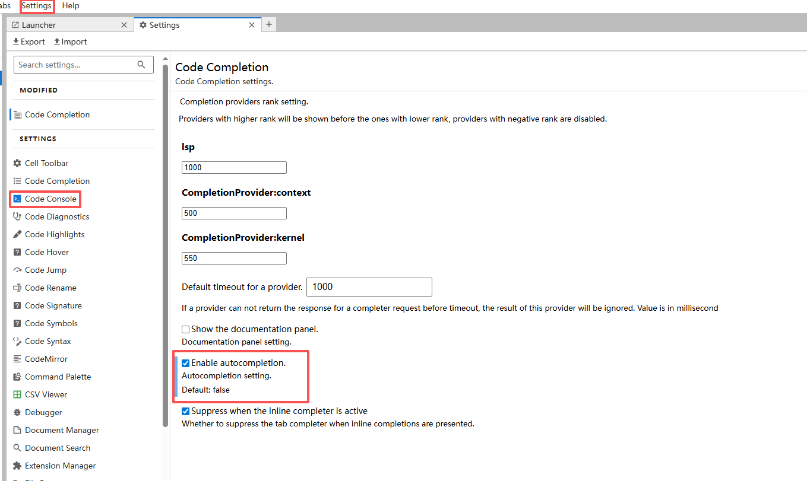
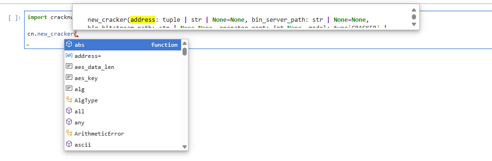

# Jupyter 代码自动补全

Jupyter 默认安装后，不能够进行代码提示以及自动补全，可以在`Jupyter`环境中安装以下插件开启该功能：

```shell
pip install jupyterlab-lsp python-lsp-server
```

默认时，代码提示需要按`Tab`键才能弹出提示的代码，如果需要自动提示，可以在`Jupyter`中进行如下的配置：



代码提示效果如下图：



安装后将开启基本的代码提示，如果您需要更高级的功能，可以把上面的`python-lsp-server`替换为`python-lsp-server[all]`，

```shell
pip install jupyterlab-lsp python-lsp-server[all]
```

<!-- truncate -->

安装后，他将包含以下额外的功能：  
- flake8（代码静态检查）
- mypy（静态类型检查）
- pylint（代码质量工具）
- rope（重构支持）

如果您对上面列表的功能不了解，建议只安装最基础的代码提示功能。