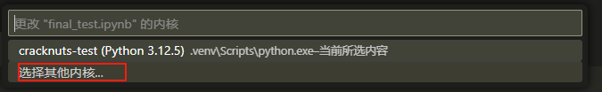

# 在 VS Code 中使用 Jupyter

数据分析、机器学习和科研中，**Jupyter** 是非常常用的工具。但有时候我们不想切换到浏览器，而是希望直接在 **VS Code** 中使用 Jupyter 的功能。幸运的是，VS Code 官方提供了强大的扩展，可以让你像在浏览器里一样运行 Notebook。并且 CrackNuts 也完全支持 VS Code 的Jupyter 环境

本文将带你一步步在 VS Code 中配置并使用 Jupyter。

## 安装 VS Code

首先确保你已经安装了：

下载地址：[https://code.visualstudio.com/](https://code.visualstudio.com/)

下载后，双击后按照提示安装即可。

## 安装 VS Code 扩展

在 VS Code 中打开 扩展（Extensions） 面板，安装以下两个扩展：

- Python
- Jupyter

## 选择 python 环境

这里的 cracknuts 环境，就是我们通过 安装脚本安装 CrackNuts 时，自动创建的 conda 虚拟环境，如果你是自己通过pip安装的，请选择你自己的python环境。

## CrackNuts 面板

以上安装完成后，即可正常打开 `Jupyter notebook` 文件，在 `VS Code` 的 `Jupyter` 环境中，`CrackNuts` 面板显示如下

