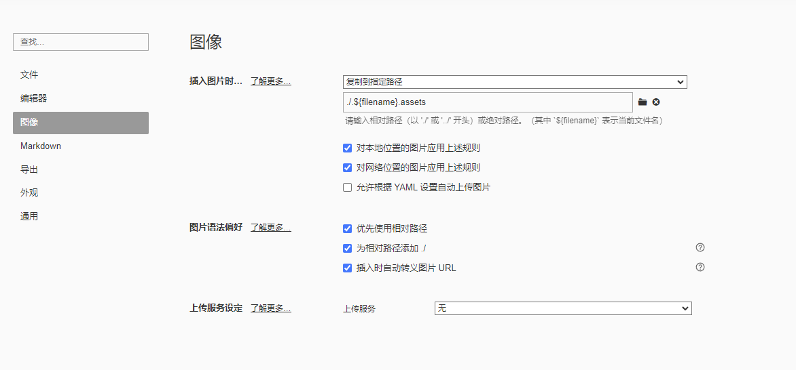

# CrackNuts Documents

Markdown语法 https://markdown.com.cn/basic-syntax/ .

## 编写规范及工具

- 文件名称统一使用英文多个单词间使用`_`进行连接，例如`getting_started.md`（忽略排序前缀的名称，排序前缀后面讲）

- 同级目录下，需要排序的需要通过文件名称或指定，如排序第一的名称为`01-getting_started.md`。效果如下：

  ```
  docs
  ├── 01-Intro.md
  ├── 02-Tutorial Easy
  │   ├── 01-First Part.md
  │   ├── 02-Second Part.md
  │   └── 03-End.md
  ├── 03-Tutorial Advanced
  │   ├── 01-First Part.md
  │   ├── 02-Second Part.md
  │   ├── 03-Third Part.md
  │   └── 04-End.md
  └── 04-End.md
  ```

- 编写文档时相关资源（图片、附件）等资源需要放到文档当前目录下的同名资源文件夹下，如：`introduction.md`相关资源放在`.introduction.assets`文件夹下，并使用相对引用，**禁止使用网络链接的图片**。

- 以第一级标题作为文档最高级标题

- 文档标题深度最大为三级，超过三级推荐写多分文档，并且使用文件夹进行分类保存。

推荐采用[Typora ](https://typoraio.cn/)编辑器编写`Markdown`文档，并且配置如下：

> ./.${filename}.assets



